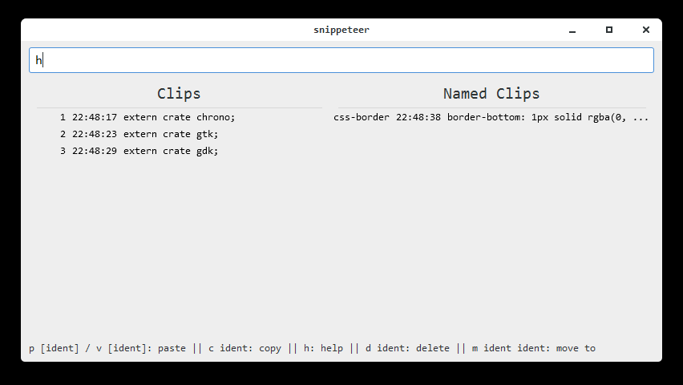

# snippeteer

A simple, shortcut-based, manual clipboard manager written in Rust using GTK (via [gtk-rs](/gtk-rs/gtk)).

## Usage

* `p | v` Store current clipboard and assign a number as id.
* `p <label> | v <label>` Store current clipboard with label to refer it by.
* `c <id/label>` Copy referenced clip into clipboard.
* `d <id/label>` Remove referenced clip.
* `m <id> <label>` Move clip from unnamed clips to named clips.
* `h | help | ?` Show help.
